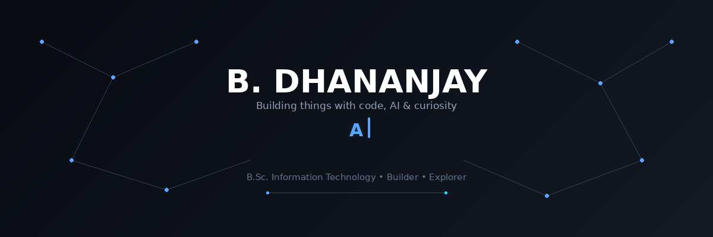

<div align="center">
  
</div>

<br>

<div align="center">

# Hey, I'm Dhananjay 👋

### I build things with code, AI & curiosity.

</div>
---

## ⚡ What I Do

<table>
<tr>
<td width="50%">

### 🤖 AI & Intelligent Systems

I like experimenting with AI, LLMs, APIs and intelligent applications — especially when there's a real problem to solve.

</td>

<td width="50%">

### 🧩 Full-Stack Development

I build web applications from frontend to backend, connecting interfaces, APIs, databases and services together.

</td>
</tr>

<tr>
<td width="50%">

### 🛠️ Backend & APIs

FastAPI, REST APIs, databases and system architecture are some of the areas I'm actively exploring.

</td>

<td width="50%">

### 🚀 Hackathons & Experiments

I enjoy taking weird ideas, turning them into prototypes and seeing how far I can push them.

</td>
</tr>
</table>

---

## 🚀 Featured Projects

<table>
<tr>
<td width="50%" valign="top">

### 🌴 GodsOwnRoute

A modern Kerala tourism experience designed to make exploring Kerala simpler, smarter, and more interactive.

**Built with:** React · TypeScript · Tailwind CSS

[🌐 Live Demo](https://godsownroute.netlify.app/) · [💻 Source Code](https://github.com/bdhananjay1213-prog/GodsownRoute)

</td>

<td width="50%" valign="top">

### 🛡️ RiskLens

A cybersecurity-focused platform for analyzing uploaded data, identifying vulnerabilities, and providing risk-aware security insights.

**Built with:** React · FastAPI · Python

[💻 Source Code](https://github.com/bdhananjay1213-prog)

</td>
</tr>
</table>

---

## 🧪 Currently Building

```text
┌──────────────────────────────────────────────────────┐
│ $ status                                             │
│                                                      │
│ ● Exploring AI systems & LLM applications            │
│ ● Building full-stack with AI                        │
│ ● Experimenting with APIs & backend architecture     │
│ ● Turning hackathon ideas into real projects         │
│                                                      │
│ > always learning. always building.                 │
└──────────────────────────────────────────────────────┘

---
```

## 🤝 Let's Connect

<div align="center">

<a href="https://www.linkedin.com/in/b-dhananjay-72a919387/">
  LinkedIn
</a>
&nbsp;&nbsp;•&nbsp;&nbsp;
<a href="https://github.com/bdhananjay1213-prog">
  GitHub
</a>
&nbsp;&nbsp;•&nbsp;&nbsp;
<a href="https://dhananjay-max-portfolio.netlify.app/">
  Portfolio
</a>

<br><br>

**Building ideas → turning them into things. 🚀**

</div>